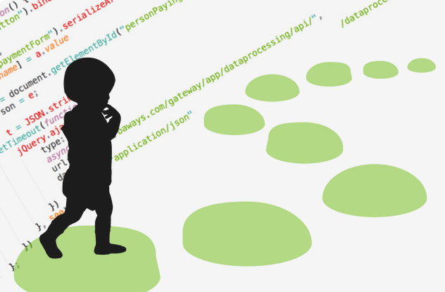

## Baby's first experience with Javascript

Having come from a background of Java, C, and C++, I immediately felt a sense of familiarity with Javascript. It has the ease of string handling and outputting to the console as Java, and the object structure reminds me of my days using C++ for object-oriented programming.

In a lot of ways, Javascript feels even simpler and more user-friendly than my previous languages. I could almost describe it as feeling like a shorthand version of how I'm used to writing code, and I feel like that's a good thing. With Javascript, writing out an algorithm is a lot faster since you don't worry as much about memory handling, type matching, or a complicated syntax.

Then again, I've never been good with shorthand, whether in handwriting or writing Javascript, as it turns out. After familiarizing myself with the basics of Javascript (ES5), I tried to learn ES6, and the shorthand syntax felt very unintuitive for me. I felt like I would never be able to remember it, and it would never make sense at a glance. Maybe that'll change with more practice and exposure.

From a software engineering perspective, I feel like Javascript is great for when you just want to get things done. In that sense, it might be especially great for coding interviews, too.
