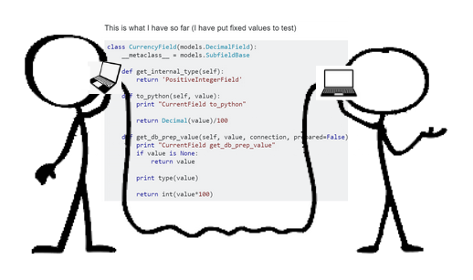

---
layout: essay
type: essay
title: The art to asking questions and guiding the helpful.
# All dates must be YYYY-MM-DD format!
date: 2021-09-09
labels:
  - engineering
--- 

# They're here and can help. 
There's so much knowledge out there in the online software engineering community. For various reasons -- including gaining experience, tracking problems and developments in the industry, and just plain wanting to help others -- a lot of those knowledgeable people are active on engineering and computer forums and might help answer your questions. You just need to ask? Or, is that all?

# What will you say?
If you ask in an effective way, then you're helping them to help you in a more effective way. It's a bit of an art form; there's no perfect technique that applies to every situation. But, it can benefit you in the end if you make your question more presentable and easier to follow upfront. Ask your question in a certain way to help others think in a certain way, and you can guide them toward the type of answer that you want (assuming they have such specific, relevant information in the first place).

## Getting the help that you want
When asking for help, it's good to first navigate to the correct forum for your question (ex. stackoverflow.com is great for programming-related questions). You can think of it as finding the right environment or grounds where you can set up your booth, stage your campaign. Essentially, you're trying to advertise for help, and you're trying to get the people around you to understand what you're saying.

Being polite is always good, and being concise and specific is excellent. It helps others if you say what you expect to happen (and, if applicable, what is happening instead). It's also helpful to say when you think the problem occurs (ex. what line in your code). If multiple events or problems happen, then it is most helpful to mention them in chronological order.

Note this post on stackoverflow.com as an example: (<a href = "https://stackoverflow.com/questions/9271820/segmentation-fault-core-dumped?rq=1"> link </a>)

In short, the poster was concise and specific in saying what they were trying to do (print any value of their array's bits), what happened instead/what problem they were having (Segmentation Fault error), and just enough background for context (they're writing in C, and they included a snippet of code directly related to their problem). In this case, their code was already short, so they didn't have to worry as much about directing helpers to a specific line or block. It's more manageable for helpers if you can already offer a line or small snippet of where you think the problem occurs, rather than asking them to find it in lots of lines of code.

In turn, the poster received effective answers. One answer suggested what the issue to fix in the code might be (the array might be exceeding the stack size) and then offered a couple of solutions for the poster to try (making the array global or allocating the array using malloc). Another answer suggested an "indispensable" programming tool for C programming (especially when writing larger programs) and for the poster's problem in particular.

## Things that push potential help away
Some ways of asking will look unattractive to potential helpers. These ways won't help people to understand what your problem is, and they might end up thinking it's not worth their time to figure out or bother with.

First, if you're not on the correct forum for your question, then you won't find people who are knowledgeable in the type of problem you're having. Therefore, they might not be equipped to help you even if they wanted to.

Second, if you're impolite, then people most likely won't want to interact with or help you.
Then, even if you're trying to be polite, you don't want to come off as begging for help. Don't use too many words in the asking when you should be focusing on describing your problem.

Don't be vague about what you were trying to do (ex. what you expected your code to output), and don't be vague about the problem you came across. Vagueness just make it take longer for people to figure out your situation, and it'll take longer for them to help you, along the way of which they might become frustrated and/or realize they can't spend so much time on your problem, because they're most likely very busy, themselves.

Note this post on stackoverflow.com as an example: (<a href = "https://stackoverflow.com/questions/13041820/segmentation-fault-strange-debug-statements?rq=1"> link </a>)

In the second paragraph of the post, the poster briefly describes a problem that they've already fixed on their own. In the third paragraph of the post, the poster uses a lot of words in just the asking for help ("I'd be grateful for any advice or scathing comments" as well as "can anyone help me figure out what's going on here"). Maybe they included these to try to be conversational and approachable, or maybe without too much thought of intent put into it. Ultimately, these parts are unnecessary and make for a longer introduction to their problem and a longer time sorting the necessary bits of information from the unnecessary ones. The poster also provides a lot of code (multiple files) as well as many lines of output without pinpointing any specific problem areas. While the poster does demonstrates effective ways of asking for help (ex. being polite, what they were trying to do, that they encountered Segmentation Fault errors).

Perhaps because of the multiple ineffective methods of asking for help, the post seemed to not receive effective answers. There is only one answer, and it does seem to sincerely offer one specific issue that is present in the poster's code (undefined behavior resulting from referencing a local variable that has already gone out of scope) as well as some explanation about it. However, the answer does not provide any solutions. Also, as shown by the poster's reply to the answer, the poster is still facing problems with their code and is confused about what to do to fix it. Meanwhile, the person who wrote the answer never returned to the post to continue the conversation.

## Luck can be a factor
Sometimes, it could be that the people who could've given you most effectively and given you the best answer, just never saw your post in the first place. 

Or, maybe they saw your post, but there were other factors that led to them not helping you (ex. they lost Internet and then had to scramble to finish their other work and thus, forgot about your post). 

However, I'd like to believe that asking for help in effective ways will give you the best chance to receive the help that you desire and, if anything, it couldn't hurt, just like eradicating ineffective methods from your questions should also lead to only better outcomes for you. 

You might have heard that engineers and computer specialists aren't the best at communicating or at making others feel good about communicating with them, but we still appreciate good communication, just like other people, and good communication skills do wonders in this field, which is filled with social interaction.
