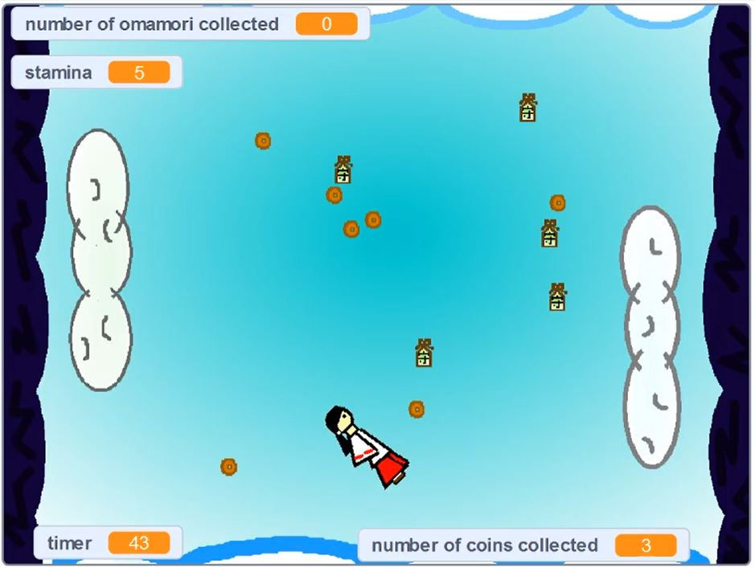

In our game, I practiced the techniques we had been learning, such as processing keyboard and mouse inputs from the user, implementing a counter (to keep track of the user's score), and conditional loops.

The objective is to collect all of the coins. The player controlls the white clouds on the left and right sides of the screen by moving them up and down. Those are the only parts of the gameplay that the player are move or control. Those clouds as well as the white clouds on the entire top and bottom borders of the screen are friendly zones that are safe for the avatar to touch. In fact, the avatar bounces off of them.

Meanwhile, if the avatar touches the evil spirit clouds (dark clouds on the entire left and right borders of the screen) or the evil spirits moving across the screen, then it will lose 1 stamina, and losing all of the avatar's stamina will result in a Game Over.

As some nice assistance for the player, if the avatar touches any of the omamori (the green items that are stationary across the screen), then it is collected. Then, the player can press the spacebar once to use up one collected omamori, and that will cause all of the evil spirits currently on the screen to disappear. This is helpful if you see the avatar is close to touching an evil spirit and want to prevent it.

There are three game modes (easy, medium, and difficult). The higher/more difficult the game mode, the faster the evil spirits move across the screen, the more coins you need to collect to win, and the less omamori that are available to collect to assist you.

 
YouTube demonstration: (<a href = "https://youtu.be/8AU2XbNhB88"> Divine Dilemma video </a>), Scratch MIT: (<a href = "https://scratch.mit.edu/"> https://scratch.mit.edu/ </a>)
