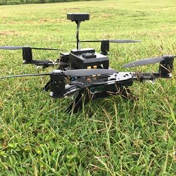

**SAMPLE (PROJECT TEMPLATE)**

  

This project took place over multiple semesters, wherein we learned Kali Linux in the first semester, and then went on to learn about drone applications and security in the next semester. Along the way, we transitioned to parsing our drones' wireless traffic and penetrating that traffic.

For this project, I we were a small team, so we were all involved in every process and step. The only tasks which we did on our own were doing project write-ups and experimenting with code.

You can learn more at the [UH Cyber Security, Drone Applications and Security VIP (Vertically Integrated Project) Website](https://sites.google.com/a/hawaii.edu/uh-vip/teams/UAS).
You can also visit the Github repository of the project: (https://github.com/M5DroneSecurity/M5DS1)

