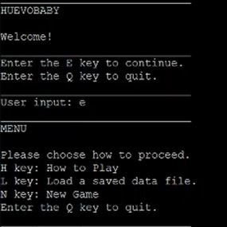

"HuevoBaby" is a simple yet well-functioning game. Since there is no graphical user interface (GUI), we wanted to be sure that the game was easy to navigate (ex. instructions, formatting of the text), the story and objective were easy to follow, and the controls were easy to use. 

I helped by writing the main function and roughly writing some of the functions and classes (if they were needed to test later parts of the main function). My other team members wrote out the functions and classes. We also collaborated on brainstorming what the game was going to be about and how the gameplay would flow, and we helped each other when we were stuck or unsure how to write some code or how the different parts of our game code fit together.

YouTube Demonstration: <a href="https://youtu.be/h5-ghsrdxdY"> HuevoBaby </a>

